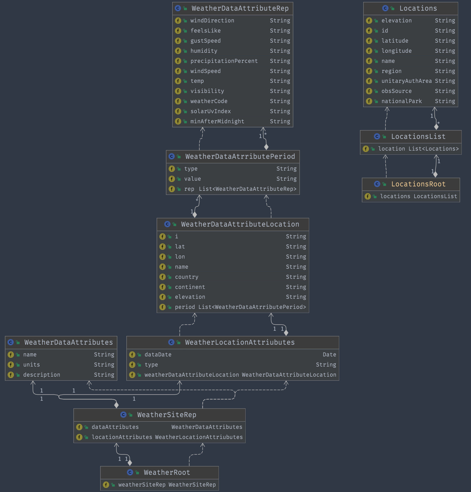

# MetOfficeWeather
<<<<<<< HEAD
Independent copy of MetOffice Java Bootcamp exercise The main branch is a starting point for the command-line exercise. The weather-wed branch is a starting point for Web application using Spring and Thymeleaf

## Relationship diagram

## REPL TODO

* Print list of locatactions
  * [x] Get api data
  * [x] marshal into data structures
  * [X] pretty print
* Gather users location Choice
  * [X] Print prompt
  * [X] Readline
  * [X] query the data
* Return data
  * [X] pretty print
  * [ ] print location-specific weather forecast

Make more general searching
Use js libraries and cards to make the data more readable